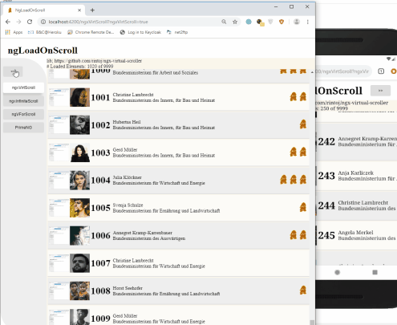
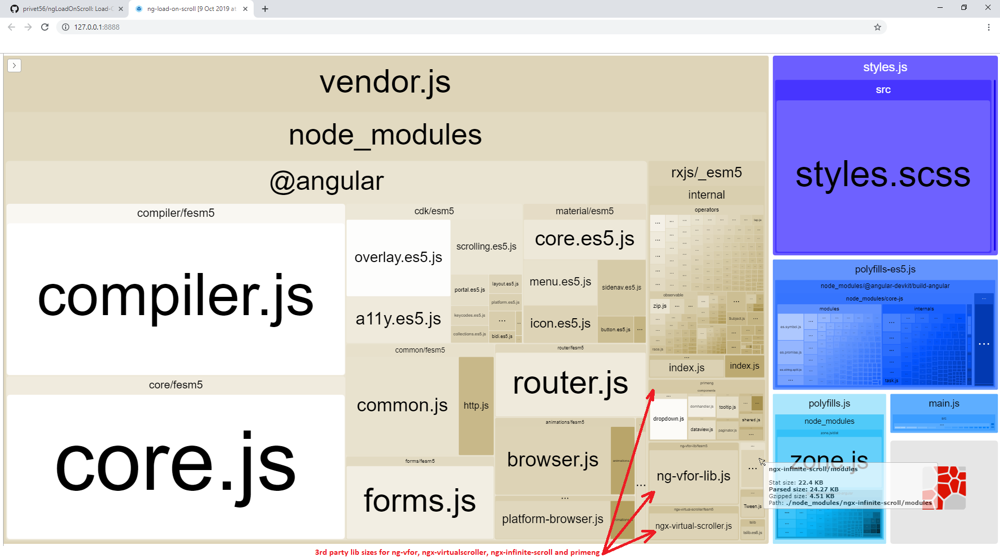

# ngLoadOnScroll

Bootstrap project:
```sh
ng new ngLoadOnScroll --directory=. --prefix=lons
npm install   # better: npm ci
ng serve --host 0.0.0.0 --disableHostCheck true
# open browser with http://localhost:4200/
```



WORK IN PROGRESS

### Virtual (=lazy-loaded) List Libs:

1.  https://github.com/rintoj/ngx-virtual-scroller
    > npm install ngx-virtual-scroller --save
    
1. https://github.com/anagram4wander/ng-vfor-lib
  ```sh
      npm install ngvforlib --save
      -- after the installation, unpack received tgz, but keep package.json
  ```
  
1. https://github.com/orizens/ngx-infinite-scroll

1. https://www.primefaces.org/primeng/#/

### Lib Sizes:
1. visualize lib size to see, which lib is small enough
```sh
  npm install --save-dev webpack-bundle-analyzer
  npm run build:stats # see package.json 
  npm run analyze     # see package.json # opens browser with http://127.0.0.1:8888/
  ```


