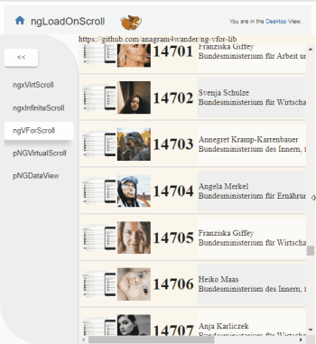

# ngLoadOnScroll

Bootstrap project:
```sh
ng new ngLoadOnScroll --directory=. --prefix=lons
npm install   # better: npm ci
ng serve --host 0.0.0.0 --disableHostCheck true
# open browser with http://localhost:4200/
```



## Virtual (=lazy-loaded) List Libs:

### 1.  https://github.com/rintoj/ngx-virtual-scroller
    > npm install ngx-virtual-scroller --save
##### Coolness:
  * It just works.
  * You don't need to know the **number** of list-elements
    
### 2. https://github.com/anagram4wander/ng-vfor-lib
  ```sh
      npm install ngvforlib --save
      -- after the installation, unpack received tgz, but keep package.json
      better: download .tgz and install from local path =>
      "ng-vfor-lib": "file:src/lib/ng-vfor-lib-0.0.9.tgz",
  ```
#### Gotchas
   * **No working npm install package available!**
   * TODO: check if the fork https://github.com/jamaks/ng-vfor-lib is better.!?
   
##### Coolness:
  * set the whole list once, rendering is done by the lib 
  
### 3. https://github.com/orizens/ngx-infinite-scroll
    > npm install ngx-infinite-scroll --save
#### Gotchas    
  * You need to know the **number** of list-elements

##### Coolness:
  * It just works.
  * is the smallest alternative (see below pic)

### 4. https://www.primefaces.org/primeng/#/
  ```sh
  npm install primeng --save
  npm install primeicons --save
  ```
#### Gotchas
   * VirtualScroller: cannot handle item height change!
   * VirtualScroller: relative Size (eg. 100%) not possible =>
      <a href="src/app/primeng-scroll/primeng-scroll.component.ts">manual resize necessary</a>
   * CSS size is large (PrimeNG makes more sense, when using several components)
##### Coolness
   * DataView is auto-sized, so, no manual styling necessary
   * the lib offers a lot of highly configurable components
   
### 5. https://alligator.io/angular/infinite-scroll/
TODO<br>
https://alligator.io/angular/infinite-scroll/<br>
https://github.com/alligatorio/angular-infinite-scroll<br>
$ npm install @angular/cdk
```ts
import { ScrollingModule} from '@angular/cdk/scrolling';
imports: [ //in your module
  ScrollingModule
]

import { CollectionViewer, DataSource } from '@angular/cdk/collections';
export class MyDataSource extends DataSource<MyModel | undefined> {
  private cachedFacts = Array.from<MyModel>({ length: 0 });
  private dataStream = new BehaviorSubject<(MyModel | undefined)[]>(this.cached);
  private subscription = new Subscription();
  connect(collectionViewer: CollectionViewer): Observable<(MyModel | undefined)[] | ReadonlyArray<MyModel | undefined>> {
    this.subscription.add(collectionViewer.viewChange.subscribe(range => {
      // Update the data
    }));
    return this.dataStream;
  }

  disconnect(collectionViewer: CollectionViewer): void {
    this.subscription.unsubscribe();
  }
}

//use:
  this.dataStream.next(this.cached);
```
```html
<cdk-virtual-scroll-viewport itemSize="100">
  <li *cdkVirtualFor="let fact of dataSource">
      <!-- list element content -->
  </li>
</cdk-virtual-scroll-viewport>
```

### 6. Develop own solution with 'IntersectionObserver'
TODO<br>
(docu: https://developer.mozilla.org/en-US/docs/Web/API/Intersection_Observer_API)<br>
(see eg. https://alligator.io/js/intersection-observer/)<br>


## Q&A
   * Q: How to reset list-element state on list-ele reuse?
      * A: override <a href="src/app/list-ele/list-ele.component.ts">@Input setter</a> and reset internal state in it!
      
   * Q: ChangeDetectorRef.detectChanges sometimes fails & throws an exception
      * A: Don't worry, it can happen when list elements are **reused**; old/invalid elements cannot be (and don't need to be) re-rendered.  
  
## Lib Sizes:
1. visualize lib size to see, which lib is small enough
```sh
  npm install --save-dev webpack-bundle-analyzer
  npm run build:stats # see package.json
  npm run analyze     # see package.json # opens browser with http://127.0.0.1:8888/
```


## State Management of the App
```sh
npm install @ngrx/store --save
# or better:
ng add @ngrx/store
npm install github:ngrx/schematics-builds --save-dev
npm install @ngrx/{store,effects,entity,store-devtools} --save  # install them on-by-one
ng config cli.defaultCollection @ngrx/schematics
ng generate action states/LotOfData         # > src/app/states/lot-of-data.actions.ts
ng generate reducer LotOfData --flat=false  # > src/app/reducers/lot-of-data.reducer.ts   # no --module
ng generate effect states/LotOfData         # > src/app/states/lot-of-data.effects.ts     # no --module
```
Take care: from now on, your State Data is read-only (=immutable)! 
("ERROR TypeError: Cannot add property 1, object is not extensible")

## Remove console.log in prod build
(For Angular v. >= 8.x)
You can change the webpack build (your settins will be merged into Angulars webpack settings)
#### 1. Install Packages
```sh
npm i -D @angular-builders/custom-webpack
npm i -D @angular-devkit/build-angular
```
#### 2. Edit [angular.json](angular.json)
set architect.build.builder to "@angular-builders/custom-webpack:browser",<br>
set architect.build.configurations.production.customWebpackConfig.path to "./extra-webpack.config.prod.js"<br>
        (so you override the PROD configuration only)
#### 3. Create extra-webpack.config.prod.js
(this cfg will be **merged** with the default Angular build cfg)<br>
[extra-webpack.config.prod.js](./extra-webpack.config.prod.js)

