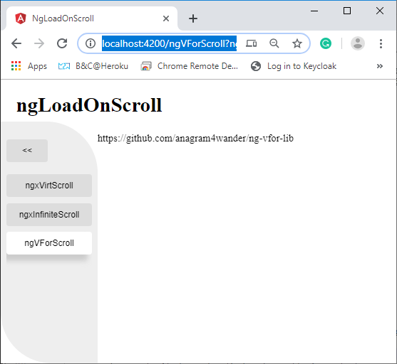

# ngLoadOnScroll

Bootstrap project:
```sh
ng new ngLoadOnScroll --directory=. --prefix=lons
npm install   # better: npm ci
ng serve --host 0.0.0.0 --disableHostCheck true
# open browser with http://localhost:4200/
```

WORK IN PROGRESS


